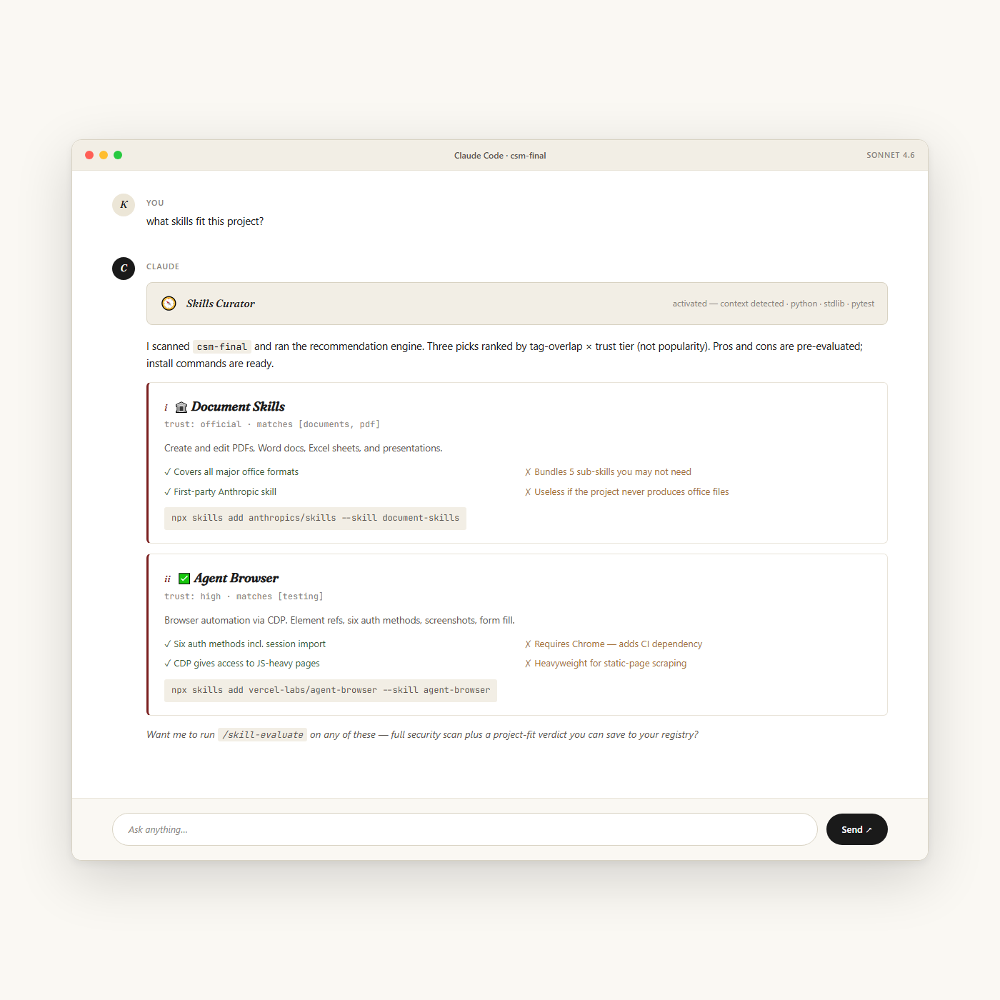
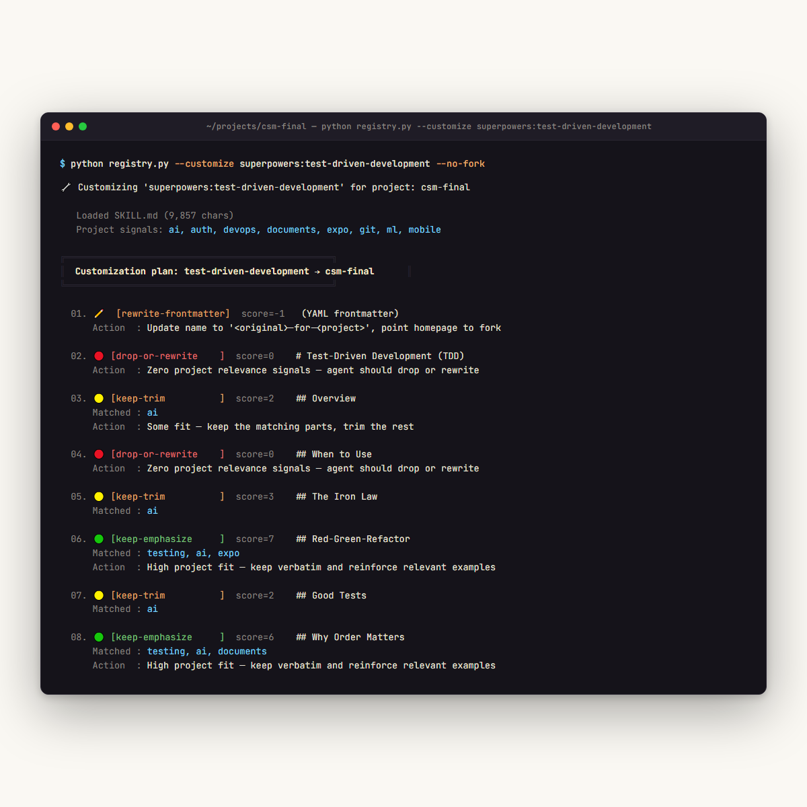

<div align="center">

# Skills Curator

**Install the skill. Customize it to your stack. Decide once, never re-decide.**

The intelligence layer for Claude skills — surfaces what fits your project, decomposes external skills into project-tailored forks, and persists every judgment.

[](https://github.com/captkernel/Skills_Curator/releases)
[](.github/workflows/validate.yml)
[](tests/)
[](#two-tiers)
[](LICENSE)
[](https://github.com/captkernel/Skills_Curator/commits)

```bash
npx skills add captkernel/Skills_Curator
```

**Status: Stable · v4.4.4 · 55 supported platforms · Lite (no deps) is default · Python tier is opt-in**

</div>

---

> **TL;DR.** Other skill managers stop at install. Skills Curator is the intelligence layer above them: it watches what you're building, surfaces skills that fit, **decomposes external skills into project-tailored forks** (so you adopt the capability without inheriting the author's voice), and persists every judgment so you never re-evaluate. Ships in two tiers — **Lite** (no Python, default) and **Python full** (tested engine, opt-in for speed on large catalogs).

<table>
<tr>
<td width="50%" valign="top">

### ✨ `--customize` — infuse, don't invoke

Most skills ship with examples from someone else's stack. `--customize` is the one feature that solves this end-to-end: it **decomposes the source SKILL.md into sections**, scores each one against your project's signals, and emits a per-section action plan (`keep` / `keep-trim` / `rewrite-stack` / `drop-or-rewrite`). The engine produces the plan; the agent rewrites the prose in your project's voice.

**Result:** Vue snippets become React snippets. Django routes become FastAPI routes. The capability transfers. The author's accent doesn't.

Nothing else in the ecosystem does this.

</td>
<td width="50%" valign="top">

### 📊 Empirical token cost — measured, not estimated

[Reproducible measurements](docs/token-cost-report.html) across 5 real projects from empty to **17,680 files**:

- **249 tokens** always-on per session (0.025% of a 1M context window)
- **1,140 tokens** max single-command stdout
- **Project size doesn't scale token cost** — the engine reads project files in a Python subprocess; only stdout enters Claude's context
- **71% savings** vs ad-hoc skill evaluation across 7 interactions

The Python engine is 27,900 tokens of code but **never enters context** — it runs as a subprocess.

</td>
</tr>
</table>

---

<details>
<summary><b>Table of contents</b></summary>

- [Quick install](#quick-install) · [Two tiers](#two-tiers) · [Demo](#demo)
- [Why this exists](#why-this-exists) · [Features at a glance](#features-at-a-glance)
- [The intelligence layer](#the-intelligence-layer) · [`--customize`](#--customize--infuse-dont-invoke)
- [Token cost](#token-cost) · [Quickstart](#quickstart) · [Platforms](#platforms)
- [Architecture](#architecture) · [Command reference](#command-reference)
- [FAQ](#faq) · [Roadmap](#roadmap) · [Project status](#project-status)
- [Security](#security) · [Contributing](#contributing) · [License](#license)

</details>

---

## Quick install

```bash
# Recommended one-liner (installs Lite by default, adds Python tier if Python 3.10+ is found):
npx skills add captkernel/Skills_Curator

# Or clone + run an installer:
git clone https://github.com/captkernel/Skills_Curator
cd Skills_Curator
bash install.sh                                      # auto: Lite + Python if 3.10+ found
bash install.sh --lite-only                          # Lite only (no Python check)
bash install.sh --with-python                        # require Python 3.10+ + install both
powershell -ExecutionPolicy Bypass -File install.ps1 # Windows (same modes via -Tier)
```

After install, the skill auto-loads in any new Claude Code session and announces itself once on first activation.

---

## Two tiers

Both ship in the same plugin. **Lite is the default** — pick it unless you have a specific reason to add the Python tier.

| | `skills-curator-lite` (default) | `skills-curator` (Python tier) |
|---|---|---|
| Engine | None — agent does the work via Bash / Read / Glob / Grep | Python 3.10+ (stdlib only, ~2.3k LOC) |
| Install friction | Zero | Python 3.10+ check |
| Project fingerprint (`--auto`) | ✅ byte-count + prefix compare | ✅ MD5-based |
| Symptom mapping, security scan, customize, migrate | ✅ feature parity | ✅ |
| Cross-device Gist sync | ❌ | ✅ |
| Speed on 100+ skills | Slower (N agent steps) | Single-pass (~1s) |
| Regression tests | None | 37 pytest cases |
| Activation token cost | ~11,000 (embeds catalog inline) | ~3,400 (delegates to engine) |

Different registry paths — they don't conflict. Install both if you want.

---

## Demo

### Skills Curator activates in a real Claude Code session



The user asks *"what skills fit this project?"*. The skill activates, reads the project context, and weaves a ranked list with trust-tier icons, pros/cons, and install commands into the response. No prompting, no manual lookup.

### What `--recommend` produces with pros/cons

```
🔍 Scanning: my-saas-app...   Stack: typescript, react

══════════════════════════════════════════════════════════
  Recommendations for: my-saas-app
══════════════════════════════════════════════════════════

  ⚡ CAPABILITY — new abilities

  01. ✅ Agent Browser
       Why     : [automation, browser, scraping]
       Trust   : high
       ✓ Pro   : Six auth methods including session import
       ✗ Con   : Requires Chrome — adds CI dependency
       Install : npx skills add vercel-labs/agent-browser

  🎨 PREFERENCE — better defaults

  01. 🏛️ Frontend Design
       Why     : [frontend, react, ui]
       Trust   : official
       ✓ Pro   : Prevents generic-looking UI defaults
       ✗ Con   : Strong opinions may conflict with team style guide
       💡 Tip   : Stack mismatch — run `--customize frontend-design`
                  to fork with rewritten examples.
```

---

## Why this exists

Existing skill tools (`npx skills`, `asm`, `vercel-labs/find-skills`) wait for you to ask. They solve plumbing — install, list, sync — and rely on you to know what to look for. **That's the wrong default**, because:

- You don't know what skills *exist* until you go searching.
- Popularity-ranked recommendations surface the same generic picks for everyone.
- You forget — six months later, you're re-evaluating a skill you already decided about.
- Every skill you bolt on imports its author's voice. Stack five external skills and your project speaks in five accents.

Skills Curator inverts the model. It's context-aware — reads what you're building and tells *you* what's worth considering. Recommendations refresh only when your project actually changes. And when you adopt a skill, `--customize` decomposes it first so it arrives in your project's voice, not the author's.

**The mental model shift: stop treating external skills as monolithic plugins to invoke. Treat them as capability libraries to absorb selectively.** Your project keeps one author. Yourself.

---

## Features at a glance

| | Other skill managers | **Skills Curator** |
|---|---|---|
| Install / list skills | ✅ | ✅ |
| **Context-aware** — recommendations match your stack, refresh on project change | ❌ | ✅ `--auto` |
| **Listens for symptoms** — *"slow tests"* → recommends test-perf skills | ❌ | ✅ `--symptoms` (17 patterns) |
| **Trust-rated catalog** — curated + live GitHub topic search | ⚠️ varies | ✅ 19 curated + live |
| **Pre-install evaluation** with pros / cons / conflicts / verdict | ❌ | ✅ Persisted forever |
| **Skill decomposition + project-voice rewrite** — adopt capability without inheriting voice | ❌ | ✅ `--customize` |
| **Pre-install security scan** — 15 risk patterns | ⚠️ post-install only | ✅ Pre-install, automatic |
| **Stack audit** — duplicates, conflicts, unreviewed skills, health scores | ❌ | ✅ One pass |
| **Cross-agent migration** with verified paths | ⚠️ partial | ✅ **55 platforms** |
| **Cross-device sync** via private GitHub Gist | ❌ | ✅ |
| **Bounded token cost** — engine reads project in subprocess, not Claude's context | ❌ | ✅ ([report](docs/token-cost-report.html)) |
| Honest about install counts (no fake popularity scraping) | ❌ | ✅ |

---

## The intelligence layer

Half of what makes Skills Curator distinctive is **context-aware judgment** — the engine reads your project and surfaces what's relevant so you don't have to search. The other half (`--customize`) ensures what you adopt arrives in your voice. Both are required for the pitch to hold.

- **`--auto`** — at session start, hashes your project's key files. If nothing changed, output is one line. If a dep was added or CLAUDE.md edited, re-runs recommendations and surfaces the top 3.
- **`--symptoms "<phrase>"`** — when the user says *"my tests are slow"*, *"deploys are manual"*, *"the UI looks ugly"*, the agent runs this. A built-in 17-pattern table maps complaints to skill categories.
- **`--find / --discover`** — familiar free-text catalog search for power users who already know what they want.

Everything else (evaluate, audit, migrate, export) is execution on top.

---

## `--customize` — infuse, don't invoke



This is the unlock. The standard model — `npx skills add <author/skill>` — installs an external skill *as-is*: their examples, their stack assumptions, their voice. Your project then speaks with their accent.

`--customize` runs differently:

1. **Decomposes the source SKILL.md** into its constituent sections (frontmatter, when-to-use, patterns, examples, anti-patterns, etc.).
2. **Reads your project's stack** — languages, frameworks, deps, goals from CLAUDE.md.
3. **Scores every section** against that fingerprint and tags an action: `keep-emphasize`, `keep-trim`, `rewrite-stack`, `drop-or-rewrite`, or `rewrite-frontmatter`.
4. **Writes a forked SKILL.md** at `~/.claude/skills/<name>-for-<project>/SKILL.md` containing the plan.
5. **The agent rewrites each section in your project's voice** — keep high-fit material verbatim, rewrite stack-mismatched examples in your stack, drop irrelevant parts entirely.

### Concrete example

Run `--customize superpowers:test-driven-development` against a Python project:

```
01. ✏️ [rewrite-frontmatter] score=-1  (YAML frontmatter)
02. 🔴 [drop-or-rewrite   ] score=0   # Test-Driven Development (TDD)
03. 🟢 [keep-emphasize    ] score=7   ## Red-Green-Refactor
    Matched : testing, ai
04. 🟡 [keep-trim         ] score=2   ## Common Rationalizations
05. 🟢 [keep-emphasize    ] score=6   ## Why Order Matters
    Matched : testing, documents
```

High-fit sections (Red-Green-Refactor, Why Order Matters) get kept and emphasized. Narrative-only sections that don't ground in your project get dropped or rewritten. The frontmatter is renamed so the fork is clearly *yours-for-this-project*. The original author's contribution becomes invisible the way a great translator's does — the meaning transfers, the accent doesn't.

```bash
python registry.py --customize <source>            # source = registered id, local path, or owner/repo@skill
python registry.py --customize <source> --no-fork  # preview the plan without writing the fork
```

---

## Token cost

Reproducibly measured against 5 real projects (empty → 17,680 files) and every CLI command. Full report at **[`docs/token-cost-report.html`](docs/token-cost-report.html)** · architecture/feature walkthrough at **[`docs/how-it-works.html`](docs/how-it-works.html)**.

| | Number |
|---|---:|
| Always-on cost per session (both tiers combined) | **249 tokens** (0.025% of a 1M context window) |
| Max single-command stdout, on a 17,680-file Next.js project | **965 tokens** |
| Max single-command stdout, on a 48-file repo | **1,140 tokens** |
| Effect of project size on cost | **None measurable** |
| Heavy-session savings vs ad-hoc evaluation | **20,038 tokens (71%)** |
| Re-asking about a previously evaluated skill | **~13 tokens** vs ~4,060 without persistence |

The Python engine is 27,900 tokens of source code, but **runs as a Bash subprocess** — Claude only sees stdout. Project files (CLAUDE.md, package.json, etc.) are read into the subprocess's own RAM, parsed, and summarized into ~250 tokens of stdout. **The 17,680-file Next.js project costs the same as a 30-file folder** because the engine caps doc reads at 4 KB and emits only summaries.

Regenerate the measurements on any machine: `pip install tiktoken && python docs/audit/deep_token_audit.py && python docs/audit/generate_html.py`.

---

## Quickstart

In any Claude Code session, ask anything below — the skill activates automatically:

> *"Should I install agent-browser for this project?"*
> → evaluates against your CLAUDE.md, runs a security scan, gives ADOPT / PARTIAL / SKIP with evidence

> *"What skills would help this project?"*
> → scans your stack, ranks recommendations by fit, returns capability + preference splits with pros/cons

> *"Audit my skills"*
> → finds duplicates, preference conflicts, security-unreviewed community skills, stale versions, low health scores

> *"Migrate my skills to Cursor and Codex"*
> → multi-target copy, with safety checks for existing files

Slash commands: `/skill-evaluate`, `/skill-recommend`, `/skill-audit`.

---

## Platforms

Skills Curator supports **55 agent platforms** as of v4.3, mirrored from `vercel-labs/skills`. **Primary first-class:** `claude-code`, `github-copilot`. Every platform listed in [`references/commands.md`](skills/skills-curator/references/commands.md) has a verified install path.

```bash
python registry.py --platforms                # detected + primary
python registry.py --platforms --verbose      # all 55
python registry.py --migrate cursor,codex     # multi-target install
python registry.py --migrate detected         # every platform on this machine
```

---

## Architecture

```
   Claude's context              Subprocess (Python)        External resources
  ┌──────────────────┐         ┌────────────────────┐     ┌──────────────────────┐
  │ SKILL.md (3.4K)  │  Bash   │   registry.py      │     │  project files       │
  │ description (62) │ ──────► │   reads project    │ ◄─► │  GitHub API (24h)    │
  │ stdout (10-1.2K) │ ◄────── │   parses signals   │     │  registry on disk    │
  │ + agent's reads  │ stdout  │   emits stdout     │     └──────────────────────┘
  └──────────────────┘         └────────────────────┘
```

Token cost happens only inside the purple box (Claude's context). Everything else runs in Python memory, free. Full diagram + step-by-step walkthrough: **[`docs/how-it-works.html`](docs/how-it-works.html)**.

---

## Command reference

```bash
R="$HOME/.claude/skills/skills-curator/scripts/registry.py"

# Intelligence layer (proactive)
python "$R" --auto                              # scan only on project drift
python "$R" --symptoms "tests are slow"         # map complaint to skills
python "$R" --recommend                         # what fits this project (with pros/cons)

# Evaluation + history
python "$R" --eval ID PROJECT VERDICT "summary" --pros "..." --cons "..."
python "$R" --history <skill-id>                # all past evaluations
python "$R" --export-eval <skill-id>            # PR-ready markdown

# Customization (the headline capability)
python "$R" --customize <source>                # fork external skill for this project
python "$R" --customize <source> --no-fork      # preview plan only

# Maintenance + discovery
python "$R" --audit                             # duplicates, conflicts, stale, unreviewed
python "$R" --check <path>                      # security scan a skill folder
python "$R" --discover [term]                   # search live catalog
python "$R" --migrate cursor,codex              # cross-agent copy

# Sync (Python tier only)
python "$R" --sync   |   --push                 # private GitHub Gist
```

Full reference (every command + flag): [`skills/skills-curator/references/commands.md`](skills/skills-curator/references/commands.md).

---

## FAQ

<details>
<summary><b>Why no install counts?</b></summary>

skills.sh telemetry isn't publicly accessible — only via an authenticated `sk_live_` API key. A tool whose pitch is *judgment* shouldn't lead with scraped fake popularity. We rank by **tag overlap × trust tier** instead — a 200-install skill that fits your stack beats a 50,000-install one that doesn't.

</details>

<details>
<summary><b>Do I need Python?</b></summary>

For the full version, yes — Python 3.10+ (stdlib only, no `pip install`). For Lite, no — the agent does everything via Bash/Read/Glob/Grep. Lite has feature parity except for cross-device Gist sync.

</details>

<details>
<summary><b>How is this different from `npx skills`?</b></summary>

`npx skills` is install plumbing — find, install, list, sync. Skills Curator is the layer above it: *should* you install, does it conflict with what you already have, and **how do you adopt it without inheriting the author's voice**. We use `npx skills` underneath.

</details>

<details>
<summary><b>If `--customize` rewrites in my voice, isn't that just "copy and edit"?</b></summary>

It's `copy → automated decomposition → relevance scoring per section → action plan → guided rewrite`. The engine produces a structured plan (keep/trim/drop/rewrite per section); the agent executes the rewrite using your CLAUDE.md and existing skill conventions as the style source. The scoring forces a deliberate choice on every section instead of letting mismatched examples slip through.

</details>

<details>
<summary><b>If the skill reads my project, doesn't that cost tokens?</b></summary>

No — and this is the most-missed point. The engine reads project files in a Python subprocess (its own RAM), parses them, and emits only ~250 tokens of summary to stdout. Claude never sees the raw bytes. A 17,680-file project with a 20 KB CLAUDE.md generates the same stdout size as a 30-file folder. Detailed walkthrough: [`docs/how-it-works.html`](docs/how-it-works.html).

</details>

<details>
<summary><b>Does this work on platforms other than Claude Code?</b></summary>

Yes — `--platforms` lists 55 supported agents and `--migrate` copies skills to any of them. First-class targets are Claude Code and GitHub Copilot.

</details>

<details>
<summary><b>Is my registry private?</b></summary>

Yes. Stored at `~/.claude/skills/skills-curator/registry.json`, never sent anywhere unless you explicitly enable Gist sync (set `SKILLS_CURATOR_GIST_ID` + `SKILLS_CURATOR_GITHUB_TOKEN`). Disable all outbound calls with `SKILLS_NO_TELEMETRY=1`.

</details>

<details>
<summary><b>How does external skills research work?</b></summary>

Three layers: (1) **19 curated entries** built into the script with hand-written pros/cons; (2) **GitHub topic search** (`topic:claude-skill`, `claude-code-skill`, `agent-skill`) — one call per topic, sorted by stars, cached 24h, metadata only (no SKILL.md fetched at this stage); (3) **on-demand SKILL.md fetch** when `--check` / `--customize` / `--evaluate` triggers it. Trust tier auto-classified by author membership in `_TRUSTED_AUTHORS`.

</details>

<details>
<summary><b>What if I disagree with a verdict?</b></summary>

Just evaluate again — every record is an entry in `evaluation_history`. The latest entry wins for the current verdict, but the full history is preserved. Read why past-you decided what they did via `--history <skill-id>`.

</details>

---

## Roadmap

- **v4.5** — Surface `--customize` hints directly in `--auto` and `--symptoms` output. Make the agent default to suggesting `--customize` over a raw install when the project's stack diverges from the source skill. Persist `_TRUSTED_AUTHORS` to a user config.
- **v4.6** — Skill-author helpers: `--validate-skill <path>` to scan your own SKILL.md against best practices. Bidirectional `--customize` — track when a forked skill drifts from the upstream source so you can pull future improvements without losing your rewrites.
- **v5.0** — Schema v4: snapshot the catalog at evaluation time so verdicts remain auditable even as the catalog moves on.

---

## Project status

| | |
|---|---|
| **Maturity** | Stable. v4.4.4 current. Schema v3 (stable since v4.0). |
| **Tiers** | Lite (default, zero deps) + Python full (opt-in). |
| **CI** | 3 OS × 4 Python versions on every PR (Python tier only). |
| **Tests** | 37 pytest cases (Python tier). |
| **Catalog** | 19 curated + live GitHub topic discovery (24h cache). |
| **Platforms** | 55, mirrored from `vercel-labs/skills`. |
| **License** | MIT. |
| **Maintainer** | [@captkernel](https://github.com/captkernel). |

---

## Requirements

- **Python 3.10+** for the full tier (Lite has no Python requirement)
- **Standard library only** — no `pip install` step
- **Network** — optional. Set `SKILLS_NO_TELEMETRY=1` to disable all outbound calls.

---

## Repository layout

```
Skills_Curator/
├── skills/skills-curator/         ← Python tier
│   ├── SKILL.md                   ← Auto-loads in Claude Code
│   ├── references/                ← Progressive-disclosure docs
│   └── scripts/registry.py        ← The whole engine, stdlib only (~2.3k LOC)
├── skills/skills-curator-lite/    ← Lite tier (no Python)
│   └── SKILL.md
├── .claude/commands/              ← /skill-evaluate, /skill-recommend, /skill-audit
├── .claude-plugin/plugin.json     ← Plugin manifest
├── docs/
│   ├── token-cost-report.html     ← Empirical token measurements
│   ├── how-it-works.html          ← Feature walkthrough + architecture
│   └── audit/                     ← Reproducibility scripts
├── tests/                         ← 37 pytest cases
├── install.sh / install.ps1
└── deploy.py                      ← Maintainer-only
```

---

## Security

`registry.py` is stdlib-only Python. Optional network calls go to `api.github.com` (Gist sync, version checks, **catalog topic search**) only. **It never sends your code, project content, or registry contents to any external service.** Disable all outbound calls with `SKILLS_NO_TELEMETRY=1`.

The `--check` scanner is **conservative** — it flags patterns that *could* be dangerous even when benign (like `eval()` in a registry script). That's intentional. Review flagged files and decide; don't miss something.

See [SECURITY.md](SECURITY.md) for vulnerability reporting.

---

## Contributing

PRs welcome. High-value contributions:

- **New `SECURITY_RISK_PATTERNS`** — with justification + a test in `tests/test_security_scan.py`
- **New `KNOWN_SKILLS` catalog entries** — high-trust only, with source link and pros/cons
- **New `FRAMEWORK_SIGNALS` / `GOAL_SIGNALS`** for the project scanner
- **New `_TRUSTED_AUTHORS`** entries — for trust auto-classification
- **Verified `PLATFORMS` corrections** — with a doc URL

See [CONTRIBUTING.md](CONTRIBUTING.md). All PRs must pass `pytest tests/` and `python registry.py --validate --strict`.

---

## License

[MIT](LICENSE).
